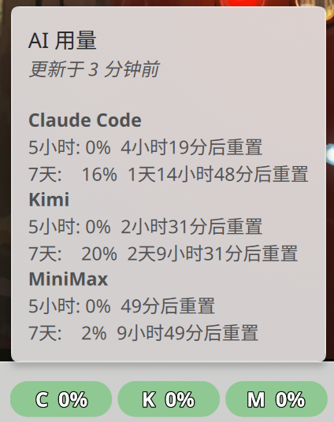
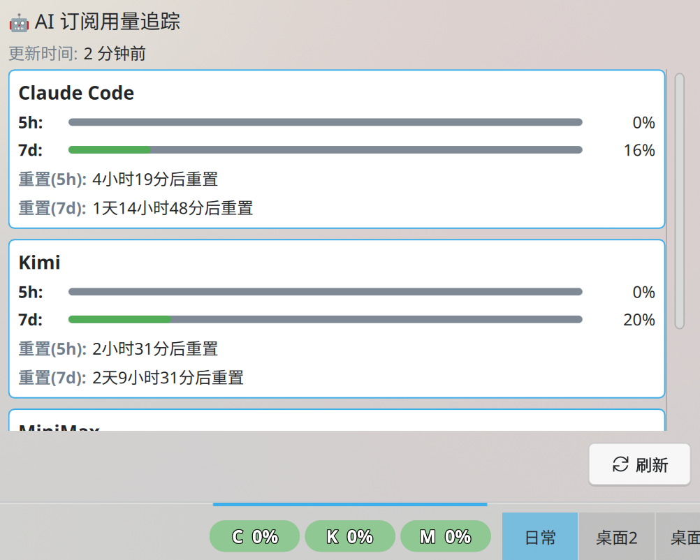

# Show AI Usage

KDE Plasma 6 任务栏小部件，实时监控 **OpenAI Codex、Claude Code、Kimi、MiniMax** 等订阅制 AI 服务的滚动窗口用量。

> 详细架构、Provider 实现与开发说明见 [Doc.md](Doc.md)。

⚠️ **注意：本项目完全由 AI 开发，请自行注意保护个人隐私！**

---

## 功能

- **多平台用量监控**：OpenAI Codex、Claude Code、Kimi、MiniMax 的 5 小时 / 7 天滚动窗口用量
- **两种抓取方式，逐平台可选**：
  - **直连 API**（Claude / Kimi / MiniMax）：用 Token 直接调用接口，更快、更稳，无需启动浏览器
  - **浏览器自动化**（Playwright + Edge）：用隔离登录态抓取仪表盘页面（Codex 仅支持此方式）
- **可视化面板**：面板上彩色圆角进度条，**悬停**显示精简用量，**点击**展开完整面板（进度条 + 剩余额度 + 重置时间）
- **一键跳转用量网页**：在弹出面板中点击平台名称，直接在浏览器打开该平台的官方用量页
- **用量阈值配色**：绿 / 黄 / 橙 / 红，一眼识别限速风险
- **凭据安全存储**：Token 只写入 `secrets.env`（权限 `0600`），登录态存于隔离浏览器目录（权限 `0700`），均不上传任何第三方
- **插件内完成配置**：在「数据抓取」设置页可逐平台切换抓取方式、点「一键登录」直接打开隔离浏览器、或粘贴 Token 点「保存」写入 `secrets.env`，无需手动敲命令
- **灵活配置**：抓取间隔、启用的服务商、每平台抓取方式、显示模式、数据路径、配色均可自定义
- **systemd 定时后台抓取**：安装后自动按配置间隔更新数据

---

## 面板显示

| 悬停（精简用量） | 点击（完整面板 + 可跳转） |
|------|------|
|  |  |

进度条字母含义：`O` = OpenAI Codex，`C` = Claude Code，`K` = Kimi，`M` = MiniMax。

| 颜色 | 用量 | 含义 |
|------|------|------|
| 🟢 绿 | 0–50% | 健康 |
| 🟡 黄 | 50–80% | 注意 |
| 🟠 橙 | 80–95% | 警告 |
| 🔴 红 | 95–100% | 即将限速 |

在弹出面板中点击平台名称（如 **Claude Code**）会在系统浏览器中打开对应的官方用量页面。

---

## 架构

```
systemd timer ──▶ Python Poller ──▶ 用量数据 ──▶ ~/.local/share/show-ai-usage/data.json
                      │                                   │
            ┌─────────┴─────────┐                         ▼
       直连 API            浏览器自动化           KDE Plasmoid（每 60 秒刷新）
   (Claude/Kimi/MiniMax)   (Codex/可回退)                 │
                                                          ▼
                                       面板彩色进度条 + 悬停精简 + 点击完整面板
```

| 组件 | 路径 | 说明 |
|------|------|------|
| Python Poller | `poller/` | 抓取用量并写入 JSON |
| KDE Plasmoid | `package/` | QML 小部件，读取 JSON 展示 |
| 安装脚本 | `scripts/` | 安装 / 卸载 / 构建发布包 |

---

## 前置依赖

- Python ≥ 3.11 + [uv](https://docs.astral.sh/uv/)
- Microsoft Edge（仅浏览器抓取方式需要，Playwright 驱动）
- KDE Plasma ≥ 6.0
- systemd --user（用于后台定时抓取）

---

## 安装

```bash
git clone https://github.com/wym68/show_ai_usage.git show-ai-usage
cd show-ai-usage
./scripts/install.sh
```

安装脚本会启动**交互式引导**，逐个平台让你选择抓取方式（浏览器登录 / 直连 API）并完成凭据录入。如需跳过引导，使用 `./scripts/install.sh --no-onboard`。

安装完成后：右键桌面 → **添加小部件** → 搜索 **AI Usage Monitor** → 拖到面板上。

---

## 首次使用

> **路径说明**：Plasmoid 通过 `kpackagetool6` 安装到 `~/.local/share/plasma/plasmoids/`，Python 项目留在你解压/克隆的目录中。所有 `uv run python -m poller.main` 命令都需要在项目目录下执行。

每个平台都可以二选一：**浏览器登录** 或 **直连 API**（Codex 只能浏览器登录）。

### 方式一：浏览器登录

在隔离浏览器中登录平台。登录态保存在 `~/.local/share/show-ai-usage/browser-data/`（权限 `0700`），不影响系统浏览器。

```bash
uv run python -m poller.main --login codex
uv run python -m poller.main --login claude
uv run python -m poller.main --login kimi
uv run python -m poller.main --login minimax
```

执行后会弹出浏览器窗口，手动完成登录，回到终端按 **Enter** 保存登录态。

> 也可以不敲命令：在配置面板的 **Data Polling** 标签页点该平台的「**一键登录**」按钮——同样弹出隔离浏览器，登录后**直接关闭浏览器窗口即自动保存**（GUI 启动时无终端，故以关窗代替按 Enter）。此功能依赖安装时写入的 `~/.config/show-ai-usage/runtime.conf`（记录项目路径与 uv 路径）。

### 方式二：直连 API（Claude / Kimi / MiniMax）

直连跳过 Playwright 浏览器，速度更快、不受 Cloudflare 挑战影响。用 `--set-token` 安全录入凭据（输入隐藏、不进入命令历史），写入 `~/.config/show-ai-usage/secrets.env`（权限 `0600`）：

```bash
uv run python -m poller.main --set-token claude    # Claude Code（也可自动读取 ~/.claude/.credentials.json）
uv run python -m poller.main --set-token kimi       # Kimi Code Token
uv run python -m poller.main --set-token minimax    # MiniMax API Key
```

- **Claude**：直连默认自动读取本机 `~/.claude/.credentials.json`，通常**无需手动录入 Token**。
- **MiniMax**：若本机已安装 `mmx` CLI，直连可免 Token（自动回退到 `mmx quota show`）。

### 测试抓取

```bash
# 手动抓取一次
uv run python -m poller.main --oneshot

# 查看最新数据
uv run python -m poller.main --status
```

---

## 配置

### 配置面板

右键小部件 → **配置**，包含四个标签页：

| 标签页 | 配置项 |
|--------|--------|
| **General** | 界面刷新间隔、数据过期阈值 |
| **Data Polling** | 启用/禁用抓取、抓取间隔、勾选监控的服务商、**每平台抓取方式（浏览器 / 直连）** |
| **Display** | 显示模式（5h+7d / 仅 5h / 仅 7d）、紧凑标签、最大显示数 |
| **Advanced** | 自定义数据路径、配色方案、自定义颜色 |

在 **Data Polling** 标签页中，每个平台可单独选择抓取方式（codex 固定浏览器），并按所选方式提供就地操作：

- **浏览器方式**：「**一键登录**」按钮直接打开隔离浏览器（登录后关窗即保存）；
- **直连方式**：「Token」密码输入框 + 「**保存 Token**」按钮，直接写入 `secrets.env`（`0600`）；Claude / MiniMax 可留空（自动读取 `~/.claude/.credentials.json` 或 `mmx` CLI）；
- 两种方式都同时显示对应命令并提供「复制」按钮，便于在终端执行；
- 底部「状态」行回显登录 / 保存结果。

> 配置页通过 `runtime.conf` 定位项目与 uv 来启动 poller；若该文件缺失（未经安装脚本），「一键登录」会提示改用终端命令。

### 配置文件

`~/.config/show-ai-usage/config.toml`（由 Plasmoid 自动管理，一般无需手动编辑）：

```toml
[general]
interval = 300                                              # 抓取间隔（秒）
enabled_providers = ["codex", "claude", "kimi", "minimax"]  # 启用的服务商

# 每平台抓取方式：true = 直连 API，false = 浏览器（codex 无此项，固定浏览器）
claude_use_direct_fetch = false
kimi_use_direct_fetch = true
minimax_use_direct_fetch = true

direct_fetch_browser_fallback = false  # 直连失败时是否回退到浏览器抓取（默认 false）
```

凭据（Token / API Key）**不写入 `config.toml`**，而是统一存放在 `~/.config/show-ai-usage/secrets.env`（权限 `0600`）。该文件由 `--set-token` 维护，systemd 服务通过 `EnvironmentFile=` 加载，手动 `--oneshot` 也会自动读取。环境变量优先级高于该文件。

| 服务商 | 环境变量 / secrets.env 键 | 说明 |
|--------|----------|------|
| **Claude** | `CLAUDE_CODE_ACCESS_TOKEN` | 留空则自动读取 `~/.claude/.credentials.json` |
| **Kimi** | `KIMI_CODE_ACCESS_TOKEN` | Kimi Code 访问令牌 |
| **MiniMax** | `MINIMAX_API_KEY` | MiniMax API Key；留空且装有 `mmx` CLI 时自动回退 |
| **MiniMax** | `MINIMAX_API_BASE_URL` | 接口基础地址，默认 `https://api.minimax.io`，可改为 `https://api.minimaxi.com` |

---

## 常见问题

| 现象 | 原因 | 处理 |
|------|------|------|
| 直连报错缺少凭据 | 未通过 `--set-token` 录入，也无对应环境变量 | 运行 `--set-token <provider>`，或改用浏览器登录 |
| 直连返回 401 / 403 | Token 失效、权限不足或 base URL 错误 | 重新录入令牌；确认 MiniMax base URL 正确 |
| 直连超时或失败 | 网络问题或接口变更 | 临时开启 `direct_fetch_browser_fallback = true` 回退到浏览器抓取 |
| Claude 直连无数据 | 本机无 `~/.claude/.credentials.json` 且未录入 Token | 运行 `--set-token claude` 或改用浏览器登录 |
| OpenAI Codex 没有直连选项 | Codex 仅支持浏览器登录态抓取 | 使用 `--login codex` 浏览器登录 |

---

## 卸载

```bash
./scripts/uninstall.sh          # 停止 timer + 卸载 Plasmoid（保留配置和数据）
./scripts/uninstall.sh --purge  # 同上 + 删除配置文件、密钥和数据文件
```

> 卸载后任务栏上的小部件可能仍会显示（显示 N/A），需要手动右键小部件 → **移除**，或运行 `plasmashell --replace` 重启面板。

---

## 常用命令

```bash
# 安全录入直连凭据（写入 secrets.env，权限 0600）
uv run python -m poller.main --set-token kimi

# 浏览器登录（保存登录态）
uv run python -m poller.main --login codex

# 手动抓取一次 / 查看最新数据
uv run python -m poller.main --oneshot
uv run python -m poller.main --status

# 调试某个 provider（有头浏览器 + 保存页面到 /tmp/）
uv run python -m poller.main --debug --providers codex

# 查看 / 手动触发 systemd timer
systemctl --user status show-ai-usage.timer
systemctl --user start show-ai-usage.service

# 更新 Plasmoid（修改 QML 后）
kpackagetool6 --type Plasma/Applet --upgrade package/
plasmashell --replace &

# 构建发布包（生成 dist/ 目录）
./scripts/build-plugin.sh
```
