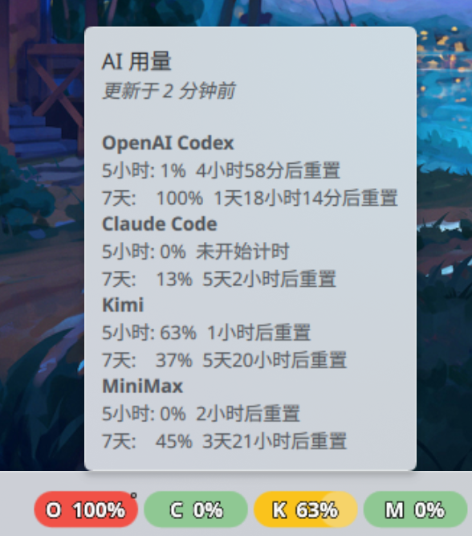

# Show AI Usage

KDE Plasma 6 任务栏小部件，实时监控 **OpenAI Codex、Claude Code、Kimi、MiniMax** 等订阅制 AI 服务的滚动窗口用量。

> 详细架构、Provider 实现与开发说明见 [Doc.md](Doc.md)。

⚠️ **注意：本项目完全由 AI 开发，请自行注意保护个人隐私！**

---

## 功能

- **多平台用量监控**：OpenAI Codex、Claude Code、Kimi、MiniMax
- **双模式抓取**：
  - 浏览器自动化（Playwright + Edge，适合 Codex / Claude Code 等需要登录态的平台）
  - 直接 API 抓取（Kimi / MiniMax，无需启动浏览器）
- **可视化面板**：4 根彩色圆角进度条，悬停显示详细用量与重置时间
- **用量阈值配色**：绿 / 黄 / 橙 / 红，一眼识别限速风险
- **灵活配置**：抓取间隔、启用的服务商、显示模式、数据路径、配色均可自定义
- **systemd 定时后台抓取**：安装后自动按配置间隔更新数据

---

## 架构

```
systemd timer ──▶ Python Poller ──▶ 用量数据 ──▶ ~/.local/share/show-ai-usage/data.json
                                          │
                                          ▼
                                  KDE Plasmoid（每 60 秒刷新）
                                          │
                                          ▼
                              面板彩色进度条 + 悬停 Tooltip
```

| 组件 | 路径 | 说明 |
|------|------|------|
| Python Poller | `poller/` | 抓取用量并写入 JSON |
| KDE Plasmoid | `package/` | QML 小部件，读取 JSON 展示 |
| 安装脚本 | `scripts/` | 安装 / 卸载 / 构建发布包 |

---

## 前置依赖

- Python ≥ 3.11 + [uv](https://docs.astral.sh/uv/)
- Microsoft Edge（Playwright 驱动）
- KDE Plasma ≥ 6.0
- systemd --user（用于后台定时抓取）

---

## 安装

```bash
git clone https://github.com/wym68/show_ai_usage.git show-ai-usage
cd show-ai-usage
./scripts/install.sh
```

右键桌面 → **添加小部件** → 搜索 **AI Usage Monitor** → 拖到面板上
---

## 首次使用

> **路径说明**：Plasmoid 通过 `kpackagetool6` 安装到 `~/.local/share/plasma/plasmoids/`，Python 项目留在你解压/克隆的目录中。所有 `uv run python -m poller.main` 命令都需要在项目目录下执行。

### 浏览器登录（Codex / Claude Code 必需，其他可选）

首次使用前，在隔离浏览器中登录各平台。登录态保存在 `~/.local/share/show-ai-usage/browser-data/`，不影响系统浏览器。

```bash
uv run python -m poller.main --login codex
uv run python -m poller.main --login claude
uv run python -m poller.main --login kimi
uv run python -m poller.main --login minimax
```

执行命令后会弹出浏览器窗口，手动完成登录，回到终端按 **Enter** 保存登录态。

### 测试抓取

```bash
# 手动抓取一次
uv run python -m poller.main --oneshot

# 查看最新数据
uv run python -m poller.main --status
```

---

## 配置

### 配置面板

右键小部件 → **配置**，包含四个标签页：

| 标签页 | 配置项 |
|--------|--------|
| **General** | 界面刷新间隔、数据过期阈值 |
| **Data Polling** | 启用/禁用抓取、抓取间隔、选择监控的服务商 |
| **Display** | 显示模式（5h+7d / 仅 5h / 仅 7d）、紧凑标签、最大显示数 |
| **Advanced** | 自定义数据路径、配色方案、自定义颜色 |

### 配置文件

`~/.config/show-ai-usage/config.toml`（由 Plasmoid 自动管理，一般无需手动编辑）：

```toml
[general]
interval = 300                                              # 抓取间隔（秒）
enabled_providers = ["codex", "claude", "kimi", "minimax"]  # 启用的服务商

[locale]
# timezone = "Asia/Shanghai"                                # 浏览器时区，留空自动检测
```

### 直接 API 抓取（Kimi / MiniMax）

直接抓取跳过 Playwright 浏览器启动，速度更快、不受 Cloudflare 挑战影响。凭据可通过环境变量或 `config.toml` 配置，**环境变量优先级高于配置文件**。

| 服务商 | 环境变量 | 配置键 | 说明 |
|--------|----------|--------|------|
| **Kimi** | `KIMI_CODE_ACCESS_TOKEN` | `kimi_code_access_token` | Kimi Code 访问令牌 |
| **MiniMax** | `MINIMAX_API_KEY` | `minimax_api_key` | MiniMax API Key |
| **MiniMax** | `MINIMAX_API_BASE_URL` | `minimax_api_base_url` | 接口基础地址，默认 `https://api.minimax.io`，可改为 `https://api.minimaxi.com` |

在 `~/.config/show-ai-usage/config.toml` 的 `[general]` 段添加：

```toml
[general]
# ... 其他配置 ...
direct_fetch_browser_fallback = false  # 直抓失败时是否回退到浏览器抓取（默认 false）

kimi_code_access_token = ""            # 或留空，从 KIMI_CODE_ACCESS_TOKEN 读取
minimax_api_key = ""                   # 或留空，从 MINIMAX_API_KEY 读取
minimax_api_base_url = "https://api.minimax.io"
```

- `direct_fetch_browser_fallback = false`（默认）时，Kimi / MiniMax 直抓失败直接报错，不会悄悄切回浏览器；设为 `true` 时才会回退到浏览器抓取。

---

## 面板显示



| 颜色 | 用量 | 含义 |
|------|------|------|
| 🟢 绿 | 0–50% | 健康 |
| 🟡 黄 | 50–80% | 注意 |
| 🟠 橙 | 80–95% | 警告 |
| 🔴 红 | 95–100% | 即将限速 |

进度条字母含义：`O` = OpenAI Codex，`C` = Claude Code，`K` = Kimi，`M` = MiniMax。

当 7 天用量超过 85% 时，小部件会自动切换为显示 7 天用量；否则显示 5 小时用量。

---

## 常见问题

| 现象 | 原因 | 处理 |
|------|------|------|
| Kimi / MiniMax 报错缺少凭据 | 未设置环境变量，且 `config.toml` 中对应字段为空 | 设置对应环境变量或在配置文件中填写 |
| 直抓返回 401 / 403 | Token 失效、权限不足或 base URL 错误 | 检查令牌有效期；确认 MiniMax base URL 正确 |
| 直抓超时或失败 | 网络问题或接口变更 | 临时开启 `direct_fetch_browser_fallback = true` 回退到浏览器抓取 |
| OpenAI Codex / Claude Code 没有直抓选项 | Codex 与 Claude Code 仍需要浏览器登录态 | 继续使用 `--login codex` / `--login claude` 浏览器登录 |

---

## 卸载

```bash
./scripts/uninstall.sh          # 停止 timer + 卸载 Plasmoid（保留配置和数据）
./scripts/uninstall.sh --purge  # 同上 + 删除配置文件和数据文件
```

> 卸载后任务栏上的小部件可能仍会显示（显示 N/A），需要手动右键小部件 → **移除**，或运行 `plasmashell --replace` 重启面板。

---

## 常用命令

```bash
# 手动抓取一次
uv run python -m poller.main --oneshot

# 查看最新数据
uv run python -m poller.main --status

# 调试某个 provider（有头浏览器 + 保存页面到 /tmp/）
uv run python -m poller.main --debug --providers codex

# 查看 / 手动触发 systemd timer
systemctl --user status show-ai-usage.timer
systemctl --user start show-ai-usage.service

# 更新 Plasmoid（修改 QML 后）
kpackagetool6 --type Plasma/Applet --upgrade package/
plasmashell --replace &

# 构建发布包（生成 dist/ 目录）
./scripts/build-plugin.sh
```
